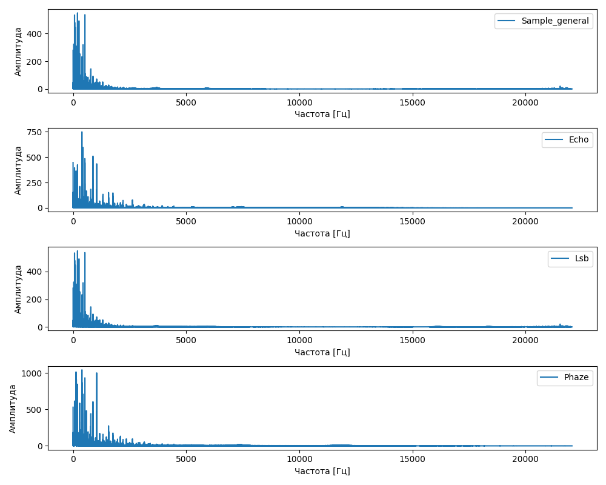
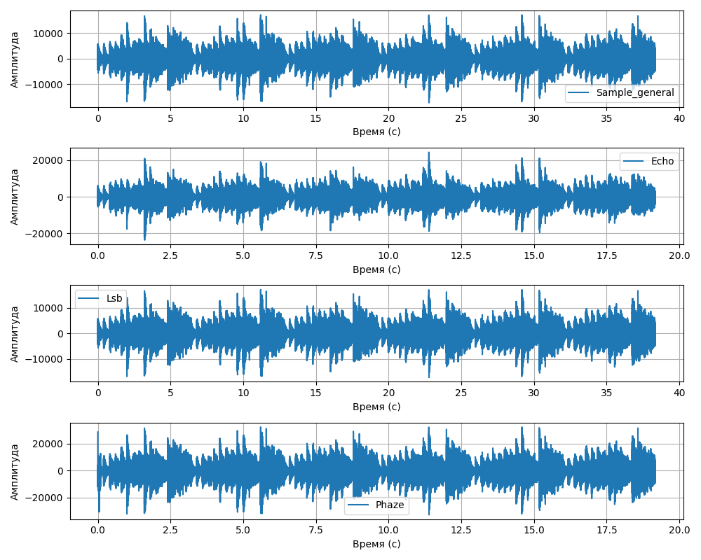

# WAV Steganography Tool

## Описание
**WAV Steganography Tool** — это минималистичная программа с графическим интерфейсом для скрытия текстовых сообщений в WAV-аудиофайлах с использованием метода **LSB (Least Significant Bit)**. Программа позволяет зашифровать сообщение в аудиофайл и извлечь его обратно, сохраняя качество звука практически неизменным.

## Как работает программа
Программа использует стеганографию для внедрения данных в WAV-файлы. Вот как это происходит:

### Шифрование
1. Читает WAV-файл и извлекает его **сэмплы** (16-битные значения амплитуды звука).
2. Преобразует текстовое сообщение в **биты** (8 битов на символ).
3. Заменяет **младший бит (LSB)** каждого сэмпла на бит сообщения.
4. Сохраняет изменённый файл в папку `template/output`.

### Дешифрование
1. Читает зашифрованный WAV-файл.
2. Извлекает **младшие биты** сэмплов.
3. Собирает биты в байты и преобразует их обратно в текст.

### Версия Python 3.10.0 

### Пример работы:

### Исследование методов стенографии
1. Эхо-кодирование
2. LSB
3. Фазовое кодирование

Изображения представляют собой частотный анализ исходного файла и файлов в которых уже есть закодированная информация одним из способов кодирования.

| Метод           | SNR          | Leakage          |
|-----------------|--------------|------------------|
| Echo            | 5.39         |  0.3428          |
| LSB             | 72.25        |  0.0000          |
| Phaze           | 24.97        |  0.2873          |

Метод SNR (Signal-to-Noise Ratio, отношение сигнал/шум) используется для оценки качества звукового сигнала путём сравнения уровня полезного сигнала с уровнем шума

Метод оценки степени утечки информации (Leakage) в контексте аудиостеганографии оценивает, насколько сильно внедрение скрытых данных влияет на аудиофайл и насколько легко можно обнаружить эти данные. 
